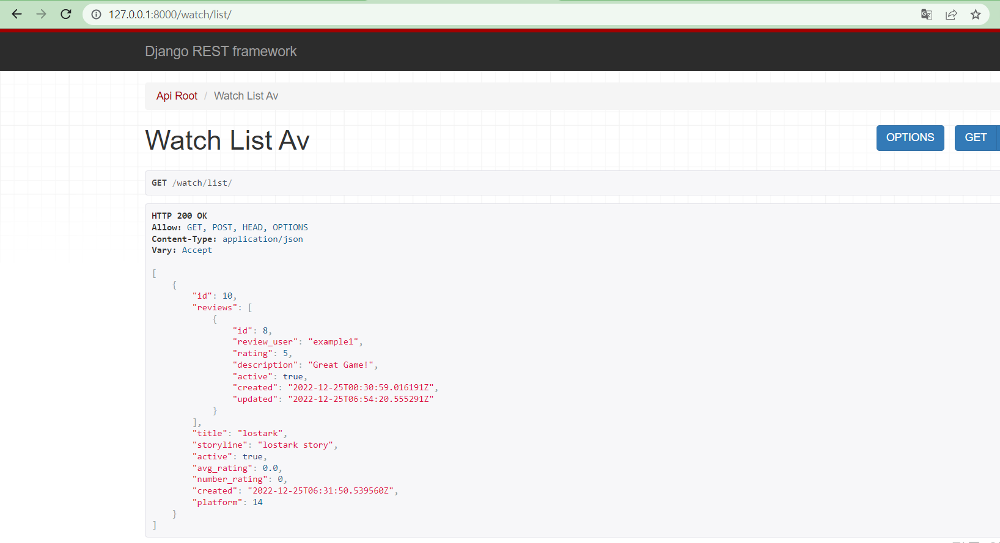
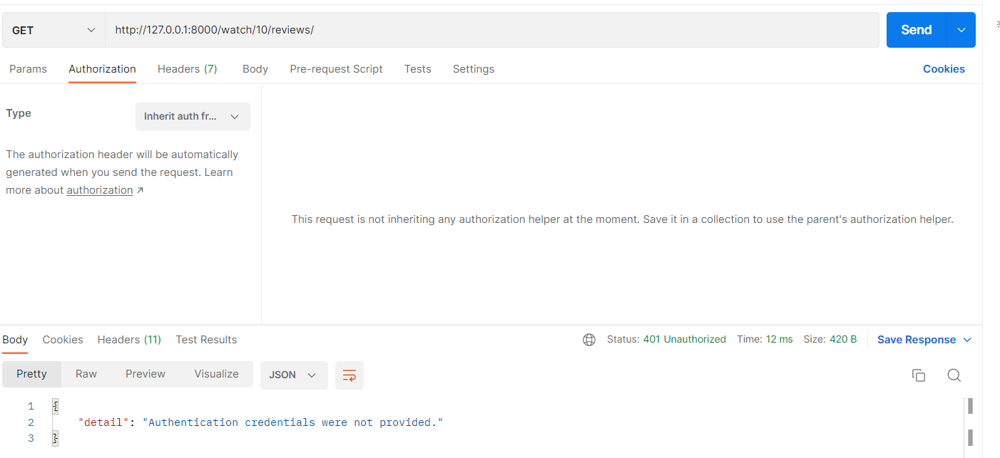
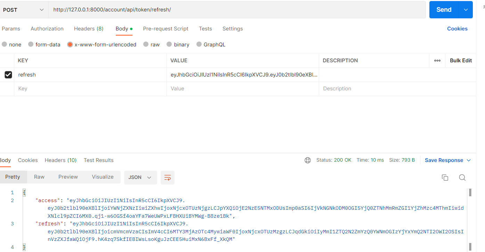
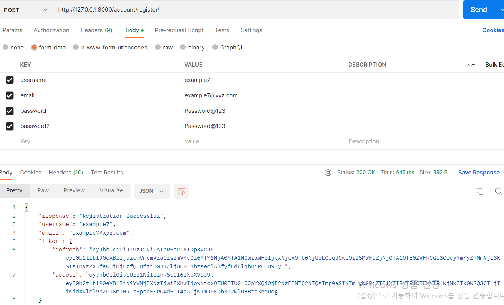
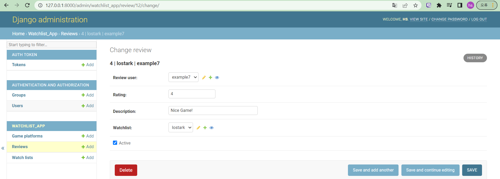
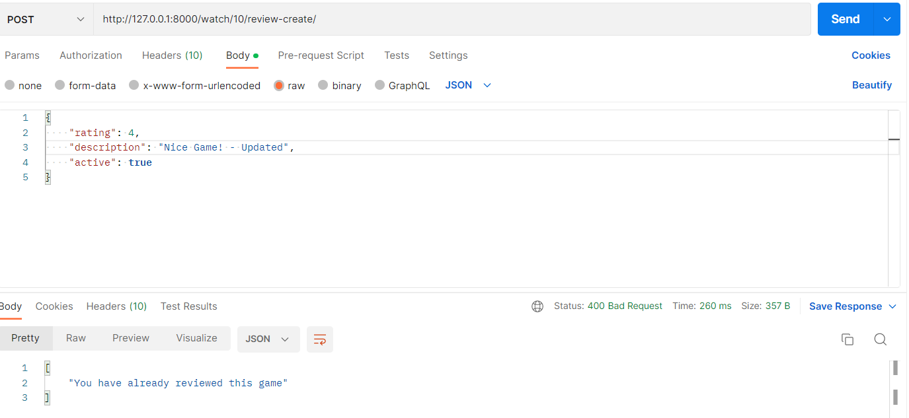

### 1. 디렉토리 구조
```bash
WATCHMATE
├── user_app
│   ├── api
│   │    ├── serializers.py
│   │    ├── urls.py
│   │    └── views.py
│   └── models.py
├── watchlist_app
│   ├── api
│   │    ├── permissions.py
│   │    ├── Serializers.py
│   │    ├── urls.py
│   │    └── views.py
│   └── model.py
├── watchmate
│    ├── settings.py
│    └── urls.py
└── manage.py
``` 

### (1) watchmate: default app
- settings.py: Django 프레임워크의 모든 개발 환경 세팅
- urls.py: urlpatterns를 구현

### (2) watchlist_app: 주요 항목에 대한 기능 구현 및 항목 클래스 간 연결 app
- api: api구현하는 부분을 api폴더를 만들어 해당 폴더 내에서 필요한 부분들을 구현 
    - permissions.py: Admin유저 혹은 직접 리뷰를 남긴 유저가 아니면 READ밖에 할 수 없도록 하는 기능 구현
    - Serializers.py: 모델에서 데이터를 뽑아 응답으로 보낼 때, 그 데이터의 형태를 정해주는 serializer들을 구현
    - urls.py: watchlist_app의 기능들을 토대로 동작하는 urlpatterns를 구현. 리뷰에 대한 나열, 생성, 자세한 내용 보기 등의 기능 존재
    - views.py: watchlist_app의 기능들에 대한 응답 구현
- models.py: watchlist_app의 기능들 구현

### (3) user_app: User Authentication에 대한 app
- api: api구현하는 부분을 api폴더를 만들어 해당 폴더 내에서 필요한 부분들을 구현 
    - serializers.py: Register에 대한 serializer구현
    - urls.py: register, login, logout, token을 확인하고 refresh 하는 urlpattern들을 구현
    - views.py: logout, Register에 대한 응답 구현
- models.py: auth token을 생성하는 기능 구현

## 2. Authentication 시연 과정
### (1) super users's side
<br></br>

<br></br>
lostark라는 title을 가지는 Object에 대한 watchlist이며, reviews 안에는 어떤 유저가 리뷰를 작성했는지(example1), 얼마만큼의 점수를 주었는지, 그리고 내용에 대한 정보를 담고 있다.
<br></br>
watchlist 아이디 값은 10이므로, watch/10/reviews/
(watchlist 아이디 값이 8인 리뷰에 대한 모든 권한이 있는 URL)를 통해 접근해본다.
 <br></br>
 
<br></br>
아무런 Authentication이 없어 실패했다. superuser의 토큰으로 Authentication을 수행해본다.
<br></br>
 
<br></br>
superuser hs의 토큰을 생성한 후, GET 해보면 해당 ID의 watchlist 안에 있었던 review에 대한 항목이 나오는 것을 확인할 수 있다.
<br></br>
 
<br></br>
access token이 만료되었을 경우에는 /account/api/token/refresh/ url에 refresh토큰을 입력하여 발급받을 수 있다.
<br></br>
 

### (2) other users's side(Not Staff)
username example7을 가지는 새로운 user를 등록한다.

 
<br></br>
access 토큰과 refresh 토큰을 확인할 수 있다.

<br></br>
리뷰 사이트에서 user를 example7으로 하여 리뷰를 생성한다.
<br></br>

<br></br>
example7의 access토큰으로 Authentication을 진행하고, 업데이트 된 내용을 POST하면 인증이 원활하게 진행됐고, 이미 리뷰를 작성한 게임이라는 메시지가 출력된다. 

